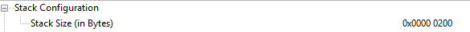
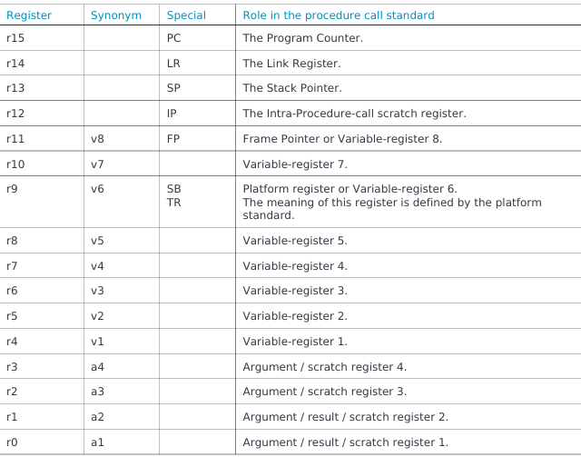

# Relatório do Lab3

**Nomes:**
* João Lucas Marques Camilo
* Bruno Ribeiro Basilio

---

## 1. Introdução

Este relatório descreve a interação com código assembly que será uma rotina dentro de um programa em C ou C++. A rotina deve gerar um histograma de uma imagem em tons de cinza. O histograma deve ser apresentado textualmente em um terminal TTY.

## 2. Planejamento do processo de desenvolvimento

* Estudo sobre instruções assembly.
* Revisão Lab2, sobre inicialização terminal TTY.
* Pesquisa sobre o contador DWT.
* Testes, depuração e sincronização com o repositório GitHub.

## 3. Definição do problema a ser resolvido

Elaborar uma rotina em assembly que será chamada de um programa em C ou C++. A rotina deve gerar um histograma de uma imagem em tons de cinza. O histograma deve ser apresentado textualmente em um terminal TTY.

## 4. Especificação da solução
Os requisitos pedidos para a solução foram os seguintes:

**Requisitos Funcionais**
* **RF1:** A função deve calcular o histograma de uma imagem em tons de cinza de 8 bits.
    * **RF1.1:** Cada pixel da imagem, com valores entre 0 e 255, deve incrementar a posição correspondente no vetor de histograma.
* **RF2:** O vetor de histograma deve ser inicializado com zero antes do processamento da imagem.
* **RF3:** A função deve retornar o total de pixels processados.
* **RF4:**  Caso o número total de pixels (largura × altura) seja superior a 65536, a função deve retornar 0 como código de erro.

**Requisitos e Restrições Não Funcionais**
* **RNF 1:** A rotina deve ser implementada em assembly ARM.
* **RNF 2:** A função deve seguir o padrão AAPCS para passagem de parâmetros entre C e assembly.
* **RNF 3:** O histograma deve utilizar inteiros sem sinal de 16 bits.
* **RNF 4:** O algoritmo deve ser eficiente, percorrendo a imagem apenas uma vez.
* **RNF 5:** O tempo de execução deve ser medido em ciclos de clock utilizando o contador DWT.

## 5. Estudo da plataforma de HW

### 5.1 Contador DWT
O contador DWT provê *watchpoints, data tracing e system profiling* para o processador. Possui até quatro comparadores, e foi utilizado o primeiro comparador, `DWT_COMP0`, que consegue comparar com o `CYCCNT` (*clock cycle counter*) a fim de conseguir a resolução de 1 clock. 

Para iniciar o contador, deve-se setar o `CYCCNT`, dando início ao contador de ciclos de 32 bits. Em *overflow*, o contador é resetado.

### 5.2 Tamanho Stack

A placa **TM4C1294NCPDT** possui, no ambiente Keil, um tamanho de pilha (stack) configurado em 512 bytes, conforme ilustrado na Imagem 1. 

Considerando um vetor de 256 posições do tipo uint16_t, o consumo total de memória é de 512 bytes. Dessa forma, a alocação desse vetor na stack pode levar a estouro de pilha (stack overflow). 

Para evitar esse problema, optou-se por utilizar o modificador static, garantindo que o vetor seja alocado em outra região de memória, fora da stack.


## 6. Estudo da plataforma de SW

### 6.1 Assembly 

#### 6.1.1 Chamada da rotina em assembly
De acordo com a documentação, para juntar dois módulos separados através do *GNU assembler*, é necessário usar o atributo `extern` no código em C para chamar uma função em assembly. É possível também fazer uma função assembly no código C utilizando o atributo `asm`.

#### 6.1.2 Argumentos
A tabela 1 mostra os registradores utilizados para passagem de parâmetros. De acordo com o padrão AAPCS, os registradores R0 a R3 são utilizados para essa finalidade e o registrador R12 pode ser utilizado como registrador temporário (intra-procedural scratch register). Caso seja necessário utilizar mais registradores, é obrigatório dar *push* na pilha (stack) no começo da função para armazenar seus valores originais, e *pop* ao sair da função.



Como o exercício requer calcular o histograma de uma imagem, teremos como parâmetros da função:

```assembly	
; Entrada:
;   R0 = largura (uint16_t)
;   R1 = altura (uint16_t)
;   R2 = ponteiro para imagem (uint8_t*)
;   R3 = ponteiro para histograma com 256 posições (uint16_t*)
; Saída:
;   R0 = total de pixels (uint16_t)
```

#### 6.1.3 Comandos Assembly
* **`PUSH`**: Coloca os registradores na pilha.
* **`POP`**: Retira os registradores da pilha, sempre respeitando a ordem.
* **`LDR`**: Armazena valor num registrador de 32 bits caso seja passada uma constante. Também pode ler um valor da memória caso seja passada uma posição de memória entre colchetes.
* **`CMP`**: Compara se dois valores/registradores são iguais (atualiza a flag Z para 1 se for verdade).
* **`BHI`**: Pula (Branch) para uma label caso a flag de *Higher* (maior que unsigned) estiver ativa.
* **`MOV`**: Move um valor direto ou de outro registrador para um registrador destino.
* **`BEQ`**: Pula (Branch) para a label se a flag Z = 1 (valores comparados eram iguais).
* **`LSL`**: Empurra os bits para a esquerda (*Logical Shift Left*), equivalente a multiplicar por 2.
* **`ADD`**: Faz operação de soma.
* **`STRH`**: Guarda o valor do registrador em uma posição de memória, determinada pelos colchetes. O 'H' vem de *Halfword* (2 bytes).

## 7. Projeto (design) da solução

**Fluxo de Execução:**
`INÍCIO CLOCK` -> `INÍCIO UART` -> `COMEÇO CONTADOR DE CICLO` -> `EightBitHistogram` -> `FIM CONTADOR DE CICLO` -> `PRINTS`

**EightBitHistogram:**
`SALVA REGISTRADORES PILHA` -> `ZERA HISTOGRAMA` -> `CONTA PIXELS` -> `RETURN`

### 7.1 Planejamento das estruturas de dados

A imagem é representada como um vetor de elementos do tipo uint8_t, onde cada posição corresponde a um pixel com valores entre 0 e 255.

O histograma é representado como um vetor de 256 posições do tipo uint16_t, onde cada índice corresponde à contagem de ocorrências de um valor de pixel.

### 7.2 Alocação de registradores

A alocação de registradores foi planejada da seguinte forma (alguns já foram detalhados anteriormente):

R0: largura da imagem (width)
R1: altura da imagem (height)
R2: ponteiro para o início da imagem
R3: ponteiro para o vetor de histograma
R4: contador total de pixels
R5: índice de iteração
R6: valor do pixel atual

### 7.3 Algoritmo da solução

O algoritmo implementado segue os seguintes passos:

1. Verificar se o número total de pixels (width × height) excede 65536. Em caso positivo, retornar 0.
2. Inicializar o vetor de histograma com zero.
3. Percorrer todos os pixels da imagem:
   - Ler o valor do pixel.
   - Incrementar a posição correspondente no vetor de histograma.
4. Retornar o total de pixels processados.

### 7.4 Organização da memória

A organização da memória pode ser representada da seguinte forma:

Imagem (uint8_t):
[p_image] → | pixel0 | pixel1 | pixel2 | ... |

Histograma (uint16_t):
[p_histogram] → | h0 | h1 | h2 | ... | h255 |

Cada posição do histograma armazena a quantidade de ocorrências de um valor específico de pixel.

### 7.5 Escolha das instruções

Para leitura dos pixels da imagem, foi utilizada a instrução LDRB, pois os dados são de 8 bits.

Para armazenamento no histograma, foi utilizada a instrução STRH, pois cada posição do histograma é composta por 16 bits.

Essa escolha garante compatibilidade com os tipos de dados utilizados e eficiência no acesso à memória.

### 7.6 UML

O diagrama a seguir representa, de forma simplificada, o fluxo de execução da função:

Início
↓
Verifica tamanho da imagem
↓
Zera histograma
↓
Loop de pixels
↓
Incrementa histograma[pixel]
↓
Fim

## 8. Configuração do projeto na IDE (Keil uVision)

O Target do Keil foi configurado selecionando o microcontrolador **TM4C1294NCPDT**. Foram inclusos os arquivos `uartstdio.h` e `uartstdio.c` para o terminal serial funcionar. Foi inclusa também a biblioteca `driverlib.lib` para as funções que dependiam dela.

Foi necessário apontar os diretórios de inclusão (Include Paths) para as seguintes pastas:
* `C:\ti\TivaWare_C_Series-2.2.0.295\utils`
* `C:\ti\TivaWare_C_Series-2.2.0.295`
* `C:\ti\TivaWare_C_Series-2.2.0.295\driverlib`
* `.\src_others`

  A organização dos arquivos do projeto segue a seguinte estrutura:

- main.c: responsável pela execução dos testes e chamada da função em assembly.
- histogram.s: implementação da função EightBitHistogram em assembly.
- images.c: contém as imagens utilizadas para teste.

## 9. Teste e depuração

### 9.1 Teste histograma
Para teste foi feito o seguinte código em C:

```C
void debug(void) {
    // 'static' tira o vetor da Stack para evitar Stack Overflow
    static uint16_t hist2[256] = {0}; 
    
    int tam = width1 * height1;
    

    for (int i = 0; i < tam; i++) {
        int pixel = p_start_image1[i];
        hist2[pixel] += 1;
    }
    
    for (int i = 0; i < 256; i++) {
        int diferenca = hist[i] - hist2[i]; 
        
        if (diferenca != 0)
            UARTprintf("Diferenca = %d\n", diferenca);
        
    }
    
    UARTprintf("Debug finalizado.\n");
}

```

Basicamente, caso haja diferença entre os histogramas, deve ser printado no terminal do PUTTY, algo que não aconteceu:

```txt
Teste com imagem do professor
Total: 19200
Clocks: 347958

Debug finalizado.

```

Isso valida que a implementação em assembly está correta, pois produziu resultados idênticos à implementação de referência em C.

### 9.2 Teste de desempenho (clock)

A medição do tempo de execução foi realizada utilizando o contador DWT_CYCCNT do processador Cortex-M4.

O procedimento consiste em:

1. Ler o valor inicial do contador antes da chamada da função.
2. Executar a função EightBitHistogram.
3. Ler o valor final do contador após a execução.
4. Calcular a diferença entre os valores.

Tempo (em ciclos) = valor_final - valor_inicial

Esse método permite obter a quantidade de ciclos de clock utilizados pela rotina, com resolução de 1 ciclo.

## 10. Referências

* [Mixing C and assembly code](https://developer.arm.com/documentation/den0013/0400/Application-Binary-Interfaces/Mixing-C-and-assembly-code)
* [Calling between C/C++ and ARM assembly language](https://developer.arm.com/documentation/dui0056/d/mixing-c--c----and-assembly-language/calling-between-c--c----and-arm-assembly-language/examples)
* [Data Watchpoint and Trace Unit](https://developer.arm.com/documentation/ddi0439/b/Data-Watchpoint-and-Trace-Unit?lang=en)
* [Control register, DWT_CTRL](https://developer.arm.com/documentation/ddi0403/d/Debug-Architecture/ARMv7-M-Debug/The-Data-Watchpoint-and-Trace-unit/Control-register--DWT-CTRL)
