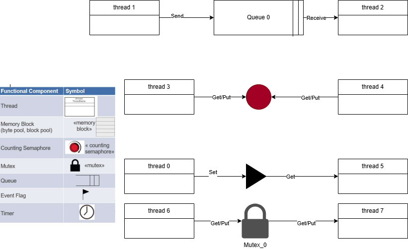

# Relatório do Lab5a

**Nomes:**  
João Lucas Marques Camilo  
Bruno Ribeiro Basilio  

---

## 1. Introdução

Este relatório apresenta a análise de uma aplicação exemplo utilizando o sistema operacional de tempo real ThreadX.

O objetivo do experimento é compreender o funcionamento de múltiplas threads, bem como os mecanismos de comunicação, sincronização e gerenciamento de memória oferecidos pelo RTOS, como filas (queues), semáforos (semaphores), mutex, event flags, byte pool e block pool.

---

## 2. Planejamento do processo de desenvolvimento

Inicialmente foi realizado o estudo do arquivo `demo_threadx.c`, identificando as threads criadas e os objetos utilizados pelo sistema.

Em seguida, foram analisadas as interações entre as threads e os mecanismos de comunicação e sincronização disponíveis no ThreadX.

Por fim, foram preenchidas as tabelas solicitadas e elaborado o diagrama de objetos representando o funcionamento do sistema.

---

## 3. Definição do problema a ser resolvido

O sistema tem como objetivo demonstrar o funcionamento básico do ThreadX por meio da criação de múltiplas threads e da utilização de diferentes mecanismos do RTOS.

O sistema deve:

- Criar oito threads com diferentes prioridades
- Realizar comunicação entre threads utilizando fila de mensagens  
- Controlar acesso a recurso compartilhado utilizando semáforo e mutex
- Sincronizar execução entre threads utilizando event flags  

---

## 4. Especificação da solução

### Requisitos Funcionais:

- RF1: Criar oito threads com diferentes prioridades  
- RF2: Implementar comunicação entre threads por meio de uma fila  
- RF3: Utilizar semáforo para controle de acesso concorrente  
- RF4: Utilizar event flags para sincronização entre threads  
- RF5: Demonstrar escalonamento com uso de prioridades e time slicing
- RF6: Utilizar mutex para controle de acesso exclusivo  
- RF7: Utilizar byte pool para alocação dinâmica de memória  
- RF8: Utilizar block pool para gerenciamento de memória em blocos  

### Requisitos Não Funcionais:

- RNF1: Utilizar o kernel ThreadX como sistema operacional de tempo real  
- RNF2: Manter organização modular do código  
- RNF3: Utilizar estruturas padrão do ThreadX  

---

## 5. Estudo da plataforma de HW

Neste experimento não há interação direta com hardware físico.

O foco do laboratório está na análise do funcionamento do sistema operacional ThreadX e no gerenciamento de tarefas em software.

---

## 6. Estudo da plataforma de SW

### 6.1 Funções utilizadas

- `tx_kernel_enter()`: Inicializa o kernel do ThreadX  
- `tx_thread_create()`: Cria uma thread  
- `tx_queue_create()`: Cria uma fila de mensagens  
- `tx_semaphore_create()`: Cria um semáforo  
- `tx_event_flags_create()`: Cria um grupo de event flags  
- `tx_thread_sleep()`: Suspende a execução da thread por um período  
- `tx_queue_send()`: Envia mensagem para a fila  
- `tx_queue_receive()`: Recebe mensagem da fila  
- `tx_semaphore_get()`: Obtém o semáforo  
- `tx_semaphore_put()`: Libera o semáforo  
- `tx_event_flags_set()`: Ativa uma flag  
- `tx_event_flags_get()`: Aguarda uma flag
- `tx_mutex_create()`: Cria um mutex  
- `tx_mutex_get()`: Obtém o mutex  
- `tx_mutex_put()`: Libera o mutex  
- `tx_byte_pool_create()`: Cria pool de memória  
- `tx_byte_allocate()`: Aloca memória do pool  
- `tx_block_pool_create()`: Cria pool de blocos  
- `tx_block_allocate()`: Aloca bloco  
- `tx_block_release()`: Libera bloco  

---

## 7. Projeto (design) da solução

O sistema é composto por oito threads que interagem entre si por meio de diferentes mecanismos do ThreadX.

### Fluxo geral de execução:

INÍCIO → Inicialização do kernel → Criação das threads e objetos → Execução concorrente

### Comportamento das threads:

- **Thread 0:** Incrementa contador, aguarda e sinaliza event flag  
- **Thread 1:** Envia mensagens para a fila  
- **Thread 2:** Recebe mensagens da fila  
- **Thread 3:** Utiliza semáforo  
- **Thread 4:** Utiliza semáforo (concorrente com thread 3)  
- **Thread 5:** Aguarda sinalização de event flag
- **Thread 6:** Utiliza mutex para acesso exclusivo a recurso compartilhado  
- **Thread 7:** Utiliza mutex (concorrente com thread 6) 

---

## 8. Configuração do projeto na IDE (Keil uVision)

O projeto foi analisado a partir do exemplo disponibilizado do ThreadX.

Para esta etapa (Lab5a), não foi necessária a execução do código na placa, sendo o foco apenas na análise estrutural do sistema.

---

## 9. Teste e depuração

Como esta etapa consiste apenas na análise do código, não foram realizados testes práticos.

A verificação do funcionamento foi feita por meio da análise lógica das interações entre as threads e dos mecanismos de comunicação e sincronização utilizados.

---

## 10. Tabela de Threads

| Thread Name | Entry Function     | Stack Size| Priority | Auto Start | Time Slicing|
|------------|---------------------|-----------|----------|------------|-------------|
| thread 0   | thread_0_entry      | 1024      | 1        | yes        | no          |
| thread 1   | thread_1_entry      | 1024      | 16       | yes        | yes (4)     |
| thread 2   | thread_2_entry      | 1024      | 16       | yes        | yes (4)     |
| thread 3   | thread_3_and_4_entry| 1024      | 8        | yes        | no          |
| thread 4   | thread_3_and_4_entry| 1024      | 8        | yes        | no          |
| thread 5   | thread_5_entry      | 1024      | 4        | yes        | no          |
|thread 6    |thread_6_and_7_entry |  1024     |8         |yes         |no           |
|thread 7    |thread_6_and_7_entry |  1024     |8         |yes         |no           |
---

## 11. Tabela de Objetos

| Name            | Control Structure      | Size                     | Location |
|-----------------|------------------------|--------------------------|----------|
| thread_0        | TX_THREAD              | sizeof(TX_THREAD)        | Data     |
| thread_1        | TX_THREAD              | sizeof(TX_THREAD)        | Data     |
| thread_2        | TX_THREAD              | sizeof(TX_THREAD)        | Data     |
| thread_3        | TX_THREAD              | sizeof(TX_THREAD)        | Data     |
| thread_4        | TX_THREAD              | sizeof(TX_THREAD)        | Data     |
| thread_5        | TX_THREAD              | sizeof(TX_THREAD)        | Data     |
|thread_6         |TX_THREAD               |sizeof(TX_THREAD)         |Data      |
|thread_7         |TX_THREAD               |sizeof(TX_THREAD)         |Data      |
| queue_0         | TX_QUEUE               | sizeof(TX_QUEUE)         | Data     |
| semaphore_0     | TX_SEMAPHORE           | sizeof(TX_SEMAPHORE)     | Data     |
| event_flags_0   | TX_EVENT_FLAGS_GROUP   | sizeof(TX_EVENT_FLAGS_GROUP) | Data |
| thread_0_stack  | array                  | 1024 bytes               | BSS      |
| thread_1_stack  | array                  | 1024 bytes               | BSS      |
| thread_2_stack  | array                  | 1024 bytes               | BSS      |
| thread_3_stack  | array                  | 1024 bytes               | BSS      |
| thread_4_stack  | array                  | 1024 bytes               | BSS      |
| thread_5_stack  | array                  | 1024 bytes               | BSS      |
| queue_0_area    | array                  | 10 × sizeof(ULONG)       | BSS      |
| mutex_0         | TX_MUTEX               | sizeof(TX_MUTEX)         | Data     |
| byte_pool_0     | TX_BYTE_POOL           | sizeof(TX_BYTE_POOL)     | Data     |
| block_pool_0    | TX_BLOCK_POOL          | sizeof(TX_BLOCK_POOL)    | Data     |
| memory_area     | array                  | 9120 bytes               | BSS      |
---

## 12. Diagrama de Objetos

O diagrama de objetos representa a interação entre as threads e os mecanismos do ThreadX:

- Thread 1 envia mensagens para a fila (`queue_0`)  
- Thread 2 recebe mensagens da fila  
- Threads 3 e 4 compartilham o semáforo (`semaphore_0`)  
- Thread 0 ativa uma event flag (`event_flags_0`)  
- Thread 5 aguarda essa event flag
- Threads 6 e 7 compartilham um mutex (`mutex_0`)  

  

---

## 13. Referências

- Documentação oficial do ThreadX  
- Material da disciplina de Sistemas Embarcados – UTFPR  
- Repositório do ThreadX no GitHub 
