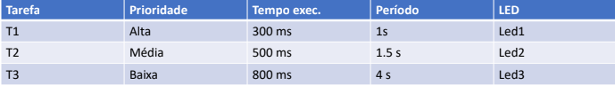

# Relatório do Lab6a - Escalonamento

**Nomes:**
* João Lucas Marques Camilo
* Bruno Ribeiro Basilio

---

## 1. Introdução

Este relatório descreve o desenvolvimento e a experimentação de um sistema embarcado utilizando o sistema operacional de tempo real (RTOS) ThreadX no microcontrolador ARM Cortex-M4 (placa TM4C1294NCPDT). O foco do experimento é criar tarefas com temporizações conhecidas e analisar visualmente o comportamento do sistema sob diferentes algoritmos de escalonamento e gerenciamento de recursos compartilhados (Mutex).

## 2. Planejamento do processo de desenvolvimento

* Estudo da documentação do RTOS ThreadX.
* Calibração de tempo de execução através do contador de ciclos de hardware (DWT).
* Implementação de uma rotina _thread-safe_ para acionamento de LEDs.
* Criação de três tarefas (threads) com diferentes tempos de execução, períodos e prioridades.
* Testes progressivos aplicando diferentes regras de escalonamento (Time-slice, Preempção, Mutex com e sem herança de prioridade).
* Sincronização e versionamento do código.

## 3. Definição do problema a ser resolvido

O objetivo central é criar um conjunto de 3 tarefas e observar na prática como variações na configuração do escalonador do ThreadX afetam o cumprimento dos prazos (períodos) de cada tarefa, além de evidenciar o fenômeno de inversão de prioridade em regiões críticas.

## 4. Especificação da solução
Os requisitos pedidos para a solução foram os seguintes:

**Requisitos Funcionais**
* **RF1:** Uma rotina que acende e apaga um LED específico por um número definido de loops de atraso.
* **RF2:** Criação de 3 threads (T1, T2 e T3) controlando os LEDs 1, 2 e 3, respectivamente.
* **RF3:** As tarefas devem respeitar a tabela de temporização:
  * T1: Prioridade Alta, Execução 300 ms, Período 1 s.
  * T2: Prioridade Média, Execução 500 ms, Período 1.5 s.
  * T3: Prioridade Baixa, Execução 800 ms, Período 4 s.

**Requisitos e Restrições Não Funcionais**
* **RNF 1:** A rotina de acionamento do LED deve ser *thread-safe*.
* **RNF 2:** O tempo de execução da rotina base deve ser medido utilizando o hardware do processador (DWT_CYCCNT).
* **RNF 3:** A temporização deve ter uma margem de erro máxima tolerável de 20%.

## 5. Estudo da plataforma de HW

### 5.1 Calibração de Tempo e Contador DWT
Para descobrir a quantidade exata de ciclos de clock que a função `blink_led` gasta, utilizou-se o contador de ciclos do Data Watchpoint and Trace (DWT) antes e depois da execução da função, realizando 1000 repetições para diluir o custo fixo (overhead) de chamada de função:

```C
    *SCB_DEMCR |= 0x01000000;
    *DWT_CYCCNT = 0;
    *DWT_CTRL |= 1;
    
    uint32_t ciclos_inicio = *DWT_CYCCNT;
    blink_led(USER_LED1, 1000); 
    uint32_t ciclos_fim = *DWT_CYCCNT;
```

Na janela de depuração do Keil, obteve-se para a variável resultante o valor de `0x00009895`, que em decimal equivale a **39.061** ciclos para 1000 iterações.

## 6. Estudo da plataforma de SW

### 6.1 ThreadX (RTOS)
O ThreadX é gerido através da função `tx_application_define`, onde recursos como blocos de memória, filas, semáforos, mutexes e threads são instanciados.
A criação de uma thread requer a definição do seu ponto de entrada, tamanho da pilha, prioridade, limiar de preempção e fatia de tempo (_time-slice_).

### 6.2 Mutex
Para simulação de região crítica, utilizou-se um Mutex, que possui um parâmetro na criação para determinar se o recurso utilizará Herança de Prioridade (`TX_INHERIT`) ou não (`TX_NO_INHERIT`).

## 7. Projeto (design) da solução

### 7.1 Cálculo da Constante de Tempo
Com o processador operando a 120 MHz, calculou-se a quantidade de loops necessários para atingir exatos 100 ms de execução:

$$\text{Ciclos por Loop} = \frac{39061}{1000} = 39,061 \text{ ciclos}$$

$$\text{LOOPS_PARA_100MS} = \frac{12.000.000}{39,061} \approx 307.211$$

### 7.2 Lógica de Suspensão (Período)
Para garantir que as tarefas executem em seus períodos corretos (Tabela 1), a lógica adotada em cada _while(1)_ foi:
`Tempo Dormindo (Sleep) = Período - Tempo de Execução`



## 8. Configuração do projeto na IDE (Keil uVision)

O Target foi configurado para o microcontrolador **TM4C1294NCPDT**. Foram incluídas as bibliotecas do `TivaWare` e os arquivos de configuração portados para o RTOS ThreadX. Utilizou-se o compilador AC6 com a flag `-Wno-macro-redefined` para inibir avisos de duplicidade de macros de mapeamento de memória entre a Texas e a ARM.

## 9. Teste e depuração

### 9.1 Escalonamento por time-slice de 50 ms
Para forçar o particionamento de tempo, os parâmetros de nível de prioridade das três threads foram igualados a 10. O _time-slice_ foi configurado como 5 (5 ticks x 10 ms = 50 ms de fatia de tempo).

```C
    tx_thread_create(&thread_0, "thread 0", thread_0_entry, 0,  
            pointer, DEMO_STACK_SIZE, 10, 10, 5, TX_AUTO_START);

    tx_thread_create(&thread_1, "thread 1", thread_1_entry, 1,  
            pointer, DEMO_STACK_SIZE, 10, 10, 5, TX_AUTO_START);

    tx_thread_create(&thread_2, "thread 2", thread_2_entry, 2,  
            pointer, DEMO_STACK_SIZE, 10, 10, 5, TX_AUTO_START);
```
**Comportamento Observado:** Os LEDs piscam alternadamente, parecendo executar em paralelo, terminando no LED que possui o maior tempo de execução estipulado. O processador divide justamente o tempo entre as 3 tarefas.

### 9.2 Escalonamento sem time-slice e sem preempção
Para executar sem preempção e respeitando a ordem de prioridade da tabela, as threads 0, 1 e 2 receberam prioridades 10, 11 e 12 respectivamente. O limiar de preempção (`preemption-threshold`) de todas foi definido em 0 (garantindo que nenhuma outra tarefa as interrompa) e o _time-slice_ foi desligado.

```C
    tx_thread_create(&thread_0, "thread 0", thread_0_entry, 0,  
            pointer, DEMO_STACK_SIZE, 10, 0, TX_NO_TIME_SLICE, TX_AUTO_START);

    tx_thread_create(&thread_1, "thread 1", thread_1_entry, 1,  
            pointer, DEMO_STACK_SIZE, 11, 0, TX_NO_TIME_SLICE, TX_AUTO_START);

    tx_thread_create(&thread_2, "thread 2", thread_2_entry, 2,  
            pointer, DEMO_STACK_SIZE, 12, 0, TX_NO_TIME_SLICE, TX_AUTO_START);
```
**Comportamento Observado:** As threads realizam sua execução sequencialmente, sem ninguém interromper a outra. Isso gera atrasos na periodicidade das tarefas de alta prioridade quando tarefas de baixa prioridade estão executando seus longos ciclos.

### 9.3 Escalonamento preemptivo por prioridade
As threads foram criadas com as prioridades corretas (Alta=10, Média=11, Baixa=12). O limiar de preempção foi definido igual ao nível de prioridade da própria tarefa, avaliando a preempção em cascata normal do RTOS.

```C
    tx_thread_create(&thread_0, "thread 0", thread_0_entry, 0,  
            pointer, DEMO_STACK_SIZE, 10, 10, TX_NO_TIME_SLICE, TX_AUTO_START);

    tx_thread_create(&thread_1, "thread 1", thread_1_entry, 1,  
            pointer, DEMO_STACK_SIZE, 11, 11, TX_NO_TIME_SLICE, TX_AUTO_START);

    tx_thread_create(&thread_2, "thread 2", thread_2_entry, 2,  
            pointer, DEMO_STACK_SIZE, 12, 12, TX_NO_TIME_SLICE, TX_AUTO_START);
```
**Comportamento Observado:** As tarefas T2 e T3 perdem seu tempo de execução para a T1 constantemente, bem como T3 perde seu tempo para T2. As tarefas com prazos mais críticos assumem o processador assim que necessário.

### 9.4 Implementação de Mutex (Sem Herança de Prioridade)
Foi criado um recurso compartilhado entre T1 e T3 instanciando um mutex que não herda prioridade:
```C
    tx_mutex_create(&mutex_0, "mutex 0", TX_NO_INHERIT);
```
Nas threads 0 e 2, o algoritmo foi alterado para solicitar o mutex no começo, rodar metade do algoritmo, e soltar o recurso para terminar a segunda metade livre.
```C
    tx_mutex_get(&mutex_0, TX_WAIT_FOREVER);
    blink_led(led, (LOOPS_PARA_100MS * tempo_thread) / 2);
    tx_mutex_put(&mutex_0);
    blink_led(led, (LOOPS_PARA_100MS * tempo_thread) / 2);
    
    tx_thread_sleep(tempo_sono);
```
**Comportamento Observado:** Acontece de forma clara o efeito de **Inversão de Prioridade Não Limitada**. No momento em que o Mutex pertence à T3, caso a T1 a interrompa, T1 não possuirá o Mutex e será bloqueada. Como a T2 (Média prioridade) não depende deste Mutex e tem prioridade maior que T3, T2 interrompe T3 livremente. O resultado é a T1 (Tarefa Crítica) esperando um tempo enorme para rodar enquanto T2 assume a CPU.

### 9.5 Implementação de Mutex (Com Herança de Prioridade)
Apenas a _flag_ de criação do mutex foi alterada:
```C
    tx_mutex_create(&mutex_0, "mutex 0", TX_INHERIT);
```
**Comportamento Observado:** Com a ativação da herança, a T3 ganha temporariamente uma prioridade maior, impedindo que a T2 consiga interrompê-la. Isso limita o atraso sofrido pela T1 estritamente ao tempo de conclusão da seção crítica da T3.

## 10. Referências

* [cite_start][ThreadX RTOS Documentation (Microsoft)](https://docs.microsoft.com/en-us/azure/rtos/threadx/) [cite: 1]
* [Data Watchpoint and Trace Unit (ARM)](https://developer.arm.com/documentation/ddi0439/b/Data-Watchpoint-and-Trace-Unit?lang=en)
```
