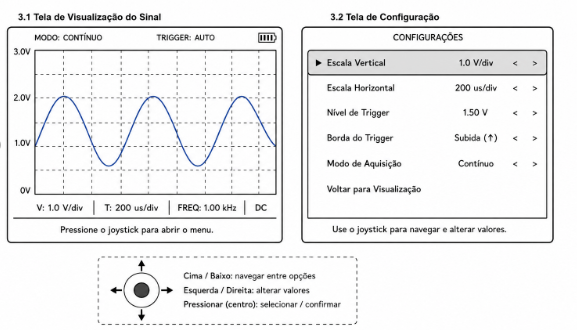
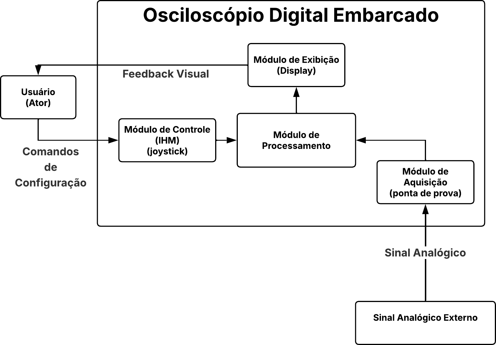

UTFPR  
UNIVERSIDADE TECNOLÓGICA FEDERAL DO PARANÁ

**Documentação de Projeto - Parte 1** **CONOPS, Domínio do Problema, Especificação** **Projeto:** Osciloscópio Digital Embarcado 
**Autores:** Bruno Ribeiro Basilio  
             João Lucas Marques Camilo

**Versão:** 25-Mar-2026

---

**Projeto - Osciloscópio Digital Embarcado**

## Parte 1a - CONOPS

### 1. Introdução
O presente projeto tem como objetivo o desenvolvimento de um osciloscópio digital embarcado capaz de adquirir sinais analógicos e apresentá-los graficamente em um display. O sistema será utilizado para visualizar sinais elétricos de baixa frequência, permitindo ao usuário acompanhar o comportamento das formas de onda em tempo real. O equipamento deverá receber sinais analógicos positivos entre 0 V e 3 V, permitindo a análise de sinais de até 2 kHz. O usuário poderá configurar parâmetros importantes do instrumento, como escala vertical, escala horizontal, taxa de aquisição e configurações de trigger. Além disso, o sistema contará com modos de operação contínuo e single-shot, permitindo tanto o monitoramento contínuo quanto a captura de eventos específicos. 

### 2. Descrição do Sistema
O sistema consiste em um osciloscópio digital embarcado responsável por adquirir sinais analógicos externos, processar essas informações e exibi-las graficamente em um display. O usuário conecta um sinal analógico à entrada do sistema e pode configurar parâmetros relacionados à visualização do sinal. Após a aquisição, o sinal é exibido na tela em forma de gráfico, permitindo acompanhar sua variação ao longo do tempo. O sistema possui dois modos principais de utilização:
* modo de configuração;
* modo de visualização do sinal.

No modo de configuração, o usuário poderá ajustar parâmetros do osciloscópio, como:
* escala vertical;
* escala horizontal;
* nível de trigger;
* borda de trigger;
* taxa de atualização;
* modo de aquisição.

Já no modo de visualização, o sistema apresenta a forma de onda do sinal recebido em tempo real. As principais interfaces do sistema são:
* entrada analógica para aquisição do sinal;
* interface de usuário para configuração;
* display para apresentação gráfica das informações.

### 3. Interface com o Usuário
A interface do sistema foi planejada para ser simples e intuitiva, permitindo ao usuário configurar os parâmetros do osciloscópio e visualizar os sinais adquiridos de maneira prática. A interação com o sistema será realizada por meio de um controle de navegação integrado ao dispositivo, permitindo navegar entre menus e alterar parâmetros do osciloscópio. A interface será composta basicamente por duas telas principais:
* tela de visualização do sinal;
* tela de configuração.

Na tela principal serão exibidos:
* o gráfico do sinal adquirido;
* escala vertical;
* escala horizontal;
* informações de trigger;
* modo de aquisição atual.

Já a tela de configuração permitirá ao usuário alterar parâmetros do sistema, como:
* escala vertical;
* escala horizontal;
* modo de aquisição;
* configurações de trigger.

A seguir sera apresentado a ideia da interface planejada para o projeto: A interface do sistema será composta por duas telas principais: a tela de visualização do sinal e a tela de configuração. A navegação entre as telas e a alteração de parâmetros será realizada por meio do joystick do BoosterPack.

### 4. Identificação dos Stakeholders
* **Usuário:** Pessoa responsável por utilizar o osciloscópio para visualização e análise de sinais elétricos.
* **Equipe de Desenvolvimento:** Responsável pela implementação, testes e documentação do sistema. Responsáveis por possíveis correções e melhorias futuras no sistema.

### 5. Necessidades de Stakeholders
**Usuário**
* Visualizar sinais de forma clara e organizada;
* Configurar facilmente os parâmetros do sistema;
* Ter atualização rápida do sinal na tela;
* Utilizar um sistema simples e intuitivo.

**Equipe de Desenvolvimento**
* Desenvolver um sistema funcional e estável;
* Facilitar testes e depuração durante o desenvolvimento;
* Produzir documentação organizada do projeto.

### 6. Cenários de Operação
**Cenário 1 - Operação Normal**
1. O usuário conecta um sinal analógico à entrada do sistema.
2. O sistema inicia a aquisição do sinal.
3. O usuário ajusta as escalas desejadas.
4. O sinal é exibido graficamente no display em tempo real.

**Cenário 2 - Operação em Single-Shot**
1. O usuário seleciona o modo single-shot.
2. O sistema aguarda a ocorrência do trigger configurado.
3. Após detectar o trigger, o sinal é capturado.
4. A forma de onda permanece exibida na tela para análise.

**Cenário 3 - Ausência de Sinal**
1. O sistema é iniciado sem nenhum sinal conectado.
2. O sistema realiza a aquisição normalmente.
3. O display apresenta uma linha constante ou ausência de variação do sinal.

**Cenário 4 - Sinal Fora da Faixa Permitida**
1. O usuário conecta um sinal acima da faixa suportada.
2. O sistema identifica comportamento inadequado na leitura.
3. O sinal pode apresentar saturação ou distorções na visualização.

---

## Parte 1b - Domínio do Problema
Esta seção aborda conceitos técnicos necessário para entender o funcionamento do osciloscópio digital.

### 1. Conversão Analógico-Digital (A/D)
Para analisar um sinal do mundo real (analógico), é necessário convertê-lo para um sinal digital. O osciloscópio irá dividir a tensão de entrada em níveis discretos, sendo o passo de quantização dado pela fórmula $q = \frac{V_{max}}{2^n}$, onde n é a quantidade de bits do conversor. 

### 2. Frequência Harmônica
Sinais elétricos reais frequentemente não são senoides perfeitas. Para representar o formato da onda com fidelidade, o sistema considerará as frequências do sinal até a sua quinta harmônica. Matematicamente, ondas complexas podem ser representadas pela soma de uma onda fundamental com suas respectivas harmônicas. Com essa definição, determina-se que a maior frequência de interesse a ser processada pelo sistema será: 2 kHz * 5 = 10 kHz.

### 3. Amostragem
Como o sinal de entrada é uma onda analógica contínua, serão coletadas amostras desse sinal para representá-lo digitalmente. Para isso, é necessário seguir o Teorema da Amostragem de Nyquist-Shannon, que estabelece que a frequência de amostragem deve ser maior que o dobro da frequência máxima do sinal. Caso contrário, o sistema sofrerá o efeito de aliasing (sobreposição indesejada de frequências). Como a maior frequência do sinal no sistema será de 10 kHz, a taxa de amostragem deve ser de pelo menos 20 kHz para evitar o alising.

### 4. Triggers
O trigger (gatilho) é o evento responsável por sincronizar a captura de dados para manter a forma de onda estável no display. Ele ocorre quando o sinal atinge uma condição de tensão programada. O comportamento da aquisição a partir desse evento pode ser configurado das seguintes formas:

1. Trigger de nível: A captura ou evento associado fica ativo enquanto o sinal se mantiver acima (ou abaixo) de um nível de tensão pré-determinado.

2. Trigger de borda: A captura é acionada no momento exato em que o sinal cruza um nível de tensão específico, avaliando apenas a transição do sinal (borda de subida ou de descida).

3. Single-shot : O sistema aguarda a condição de trigger, realiza uma única captura completa para preencher o display e congela a imagem, não realizando novas aquisições até ser rearmado pelo usuário.

---

## Parte 1c - Especificação

### 1. Introdução
O objetivo desta seção é apresentar a especificação do sistema de osciloscópio digital embarcado proposto para a disciplina de Sistemas Embarcados. O sistema será responsável por adquirir sinais analógicos, processar as amostras obtidas e apresentar graficamente as formas de onda em um display. Além disso, o usuário poderá configurar parâmetros básicos do osciloscópio por meio da interface do sistema. Esta especificação define os requisitos funcionais e não funcionais do projeto, servindo como base para as próximas etapas de desenvolvimento e implementação.

### 2. Estrutura do Sistema

O diagrama acima apresenta a arquitetura conceitual do Osciloscópio Digital do ponto de vista do usuário e de suas interações com o ambiente externo. O sistema central interage com dois atores principais: o Usuário e o Sinal Analógico Externo. Internamente, o sistema é subdividido em quatro grandes blocos lógicos operacionais:
* **Módulo de Aquisição:** Interface responsável por receber o sinal elétrico contínuo do mundo externo e traduzi-lo para o domínio do sistema.
* **Módulo de Controle (Entrada):** Interface pela qual o usuário fornece as diretrizes de funcionamento, inserindo os parâmetros de configuração (como escalas, trigger e modo de operação).
* **Módulo de Exibição (Saída):** Interface de hardware e software dedicada a traduzir os dados processados em uma representação gráfica compreensível e apresentar o status atual das configurações ao usuário.
* **Módulo de Processamento:** É responsável por orquestrar a comunicação entre os outros módulos, aplicando os critérios de amostragem no sinal adquirido e formatando os dados de acordo com as regras estabelecidas pelo módulo de controle para, finalmente, enviá-los à exibição.

### 3. Especificação Funcional
#### 3.1 Especificação da Interface com o Usuário
A interface do sistema será composta por duas telas principais:
* tela de visualização do sinal;
* tela de configuração.

Na tela principal deverão ser exibidos:
* gráfico do sinal;
* escala vertical;
* escala horizontal;
* modo de aquisição;
* informações de trigger.

A tela de configuração deverá permitir:
* ajuste da escala vertical;
* ajuste da escala horizontal;
* alteração do modo de aquisição;
* configuração do trigger.

A navegação entre as opções será realizada utilizando um controle de navegação integrado ao sistema. Os comandos do joystick serão utilizados da seguinte forma:
* cima/baixo: navegação entre opções;
* esquerda/direita: alteração de valores;
* botão central: confirmação da seleção.

### 4. Especificação Não Funcional
* **RNF-01:** O sistema deve suportar sinais de entrada com frequência de até 2 kHz.
* **RNF-02:** O sistema deve operar apenas com sinais positivos entre 0 V e 3 V.
* **RNF-03:** A atualização da tela no modo contínuo deve ocorrer em intervalo inferior a 300 ms.
* **RNF-04:** A interface deve permitir navegação utilizando o controle integrado do sistema.
* **RNF-05:** As informações exibidas no display devem ser legíveis ao usuário.
* **RNF-06:** O sistema deve operar sem perda significativa de amostras durante aquisição contínua...

### 5. Restrições
* O sistema deverá operar com sinais analógicos positivos na faixa entre 0 V e 3 V.
* O sistema deverá ser capaz de visualizar sinais de até 2 kHz.
* A interface do sistema deverá ser simples e adequada ao contexto didático do projeto.
* O sistema deverá permitir configuração dos parâmetros principais do osciloscópio por meio de uma interface embarcada integrada ao dispositivo.
