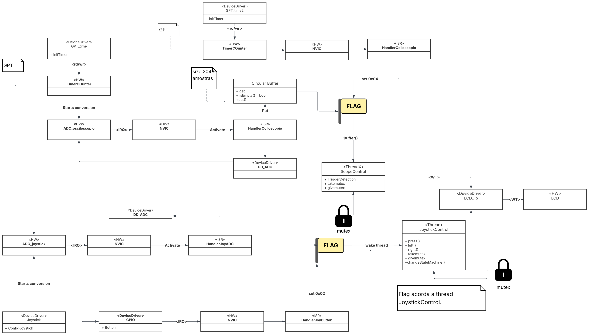
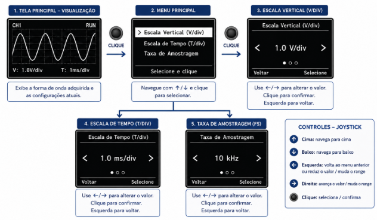
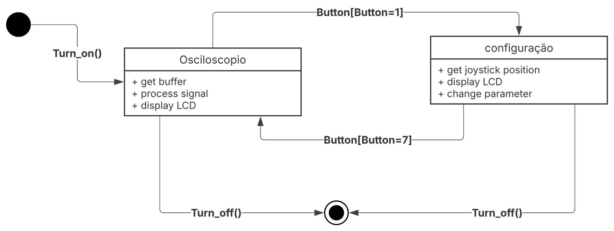
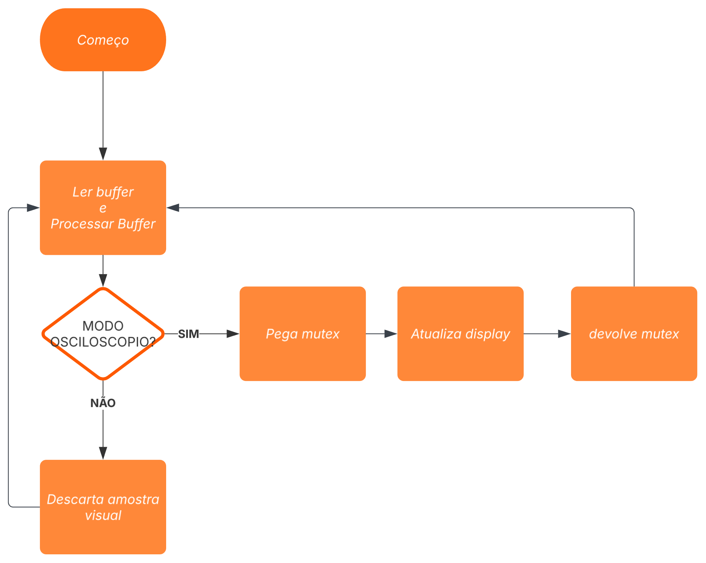

# UTFPR
## UNIVERSIDADE TECNOLÓGICA FEDERAL DO PARANÁ

**Documentação de Projeto - Parte 2**
Design, Estudo da Plataforma

* **Projeto:** Osciloscópio Diginal Embarcado
* **Autores:** Bruno, João Lucas marques Camilo
* **Versão:** 06-Junho-2026

---

## Projeto - Nome do projeto
### Parte 2a - Design

### 1 Introdução
Objetivos do documento, fazer referência ao doc anterior (CONOPS, Especificação).
Este documento tem como objetivo definir a arquitetura funcional, física e de hardware para o projeto do Osciloscópio Digital Embarcado, partindo das diretrizes já estabelecidas no CONOPS e no Documento de Especificação de Requisitos, com foco em apresentar o planejamento técnico da solução.

### 2 Arquitetura Funcional
Nessa seção está inclusa a arquitetura funcional do sistema, proposto no documento do CONOPS na seção de estrutura do sistema.

O diagrama de arquitetura funcional apresentado ilustra o fluxo de dados e a divisão lógica de responsabilidades do osciloscópio digital, abstraindo os elementos de hardware e do sistema operacional. O sistema foi particionado em quatro módulos funcionais independentes:

* **Módulo de Aquisição de Sinais:** Responsável por interagir com o meio físico externo. Este módulo realiza a amostragem do sinal de entrada contínuo (limitado entre 0 e 3V), convertendo as tensões positivas em valores digitais discretos. Ele garante a coleta ininterrupta e confiável dos dados na taxa de amostragem definida pelo sistema.
* **Módulo de Processamento:** Atua como o núcleo matemático do osciloscópio. Ele recebe os dados brutos da aquisição e aplica os algoritmos de ajuste de escala horizontal (tempo) e vertical (tensão).
* **Módulo de IHM (Interface Homem-Máquina):** Centraliza toda a interação com o usuário. Este bloco capta os iterações com o joystick e botões, interpretando-os para alternar entre os modos de operação (configuração ou visualização). Ele é o responsável por alterar os parâmetros globais que ditam o comportamento do Módulo de Processamento.
* **Módulo de Apresentação:** É o integrador final de saída. Este bloco recebe tanto os dados geométricos da onda (provenientes do processamento) quanto às informações textuais de menu (provenientes da IHM) e gerencia a atualização do display gráfico.

### 3 Arquitetura Física (Arquitetura da Solução)

### 4 Interface com o Usuário
A interface do usuário foi projetada para permitir a configuração e visualização do sinal de forma simples e intuitiva, considerando as limitações de tamanho e resolução do display LCD disponível no BoosterPack. O sistema possui dois modos principais de operação: visualização do sinal e configuração dos parâmetros de aquisição.

Na tela principal é exibida a forma de onda adquirida pelo sistema, ocupando a maior parte da área disponível do display. Também são apresentados os valores atuais da escala vertical (V/div) e da escala horizontal (T/div) permitindo ao usuário identificar rapidamente as configurações ativas durante a medição.

O acesso ao menu de configuração é realizado por meio do clique do joystick. Uma vez no menu, o usuário pode navegar pelas opções utilizando os movimentos verticais do joystick e confirmar uma seleção através do botão central. Para garantir boa legibilidade e facilidade de uso, cada tela de menu apresenta no máximo três opções simultaneamente.

O menu principal disponibiliza as seguintes configurações:
* **Escala Vertical (V/div):** ajusta a escala utilizada para representar a amplitude do sinal na tela.
* **Escala de Tempo (T/div):** ajusta a escala horizontal utilizada na exibição da forma de onda.
* **Taxa de Amostragem:** define a frequência de aquisição das amostras do sinal de entrada.

Cada parâmetro possui uma tela específica de configuração contendo valores pré-definidos. Após a seleção de um novo valor, a configuração é aplicada ao sistema e a interface retorna para a tela principal de visualização. A Figura abaixo apresenta o fluxo de navegação e o layout proposto para as telas da interface do usuário.

### 5 Mapeamento da Arquitetura Funcional à Arquitetura Física

| Elementos da Arquitetura Física (UML) | Módulo de Aquisição | Módulo de Processamento | Módulo de Controle (IHM) | Módulo de Exibição |
| :--- | :--- | :--- | :--- | :--- |
| <<HW>> Timers (Osciloscópio e IHM) | X | | X | |
| <<HW>> ADC0 e ADC1 | X | | | |
| <ISR> HandlerOsciloscopio | X | | | |
| <<RTOS>> Circular Buffer | X | X | | |
| <<Thread>> ScopeControl | | X | | X |
| <<HW>> Joystick e Botões (GPIO) | X | | X | |
| <ISR> HandlerJoyADC / Button | | | X | |
| <<RTOS>> Event Flag (Sinalizador) | | | X | |
| <<Thread>> JoystickControl | | X | X | |
| <<RTOS>> Mutex (Display_Mutex) | | X | | |
| <<Device Driver>> LCD_lib | | X | | |
| <<HW>> Display LCD | | X | | |

### 6 Arquitetura do Hardware

A solução proposta utiliza uma plataforma de hardware predefinida, baseada no kit de desenvolvimento Texas Instruments Tiva™ C Series EK-TM4C1294XL acoplado ao módulo de expansão BOOSTXL-EDUMKII (Educational BoosterPack MKII). Para atender aos requisitos de aquisição e exibição do osciloscópio, o projeto faz uso restrito e focado dos seguintes subsistemas de hardware:

* **Microcontrolador (TM4C1294NCPDT):** Processador ARM Cortex-M4F responsável por executar o sistema operacional e processar toda a matemática do osciloscópio e a lógica da interface.
* **Módulo ADC (Conversor Analógico-Digital):** Converte as entradas analógicas em dados digitais com resolução de 12 bits, dividindo a tensão lida em 4096 níveis discretos. Ele é utilizado simultaneamente para amostrar os sinais analógicos entre 0 e 3V na entrada da placa e para ler a variação de resistência dos eixos X e Y do joystick.
* **Timers de Hardware (GPTM):** Geram o sinal de disparo (trigger) para o ADC iniciar a conversão no tempo correto, garantindo a amostragem precisa de um sinal de entrada de até 2 kHz(e 10khz da sua 5 harmonica) sem consumir ciclos do processador.
* **GPIO e NVIC (Controlador de Interrupções):** O pino digital (GPIO) detecta o clique mecânico do joystick e aciona diretamente o controlador de interrupções de hardware (NVIC), enviando um sinal imediato ao sistema sem a necessidade de verificação contínua (polling).
* **Barramento SPI e Display LCD:** O barramento serial SPI transmite os comandos e dados em alta velocidade para apresentar estes sinais no display do boosterpack, atualizando a interface gráfica e a forma de onda.

### 7 Design Detalhado

**Maquina de estado**

A maquina de estado representa os dois estados do algoritmo, o primeiro sendo o modo osciloscópio, onde é plotado a onda e através do evento de click do botão do Joystick, o segundo modo , configuração, é acionado. Após precionar 7 vezes no botão do joystick ou clicar voltar, a maquina de estado volta ao seu primeiro estado.

**Fluxograma**

Esse fluxograma mostra o funcionamento da thread do Osciloscópio, em que fica num looping adquirindo sinal, fazendo as operações matemáticas, e caso esteja no estado de osciloscópio, manda as informações ao LCD, caso contrario, começa a adquirir dados novos e sobrescreve seus dados antigos.

**Escalonamento**
O sistema utiliza o ThreadX RTOS com política de escalonamento preemptivo por prioridade fixa. As interrupções são tratadas diretamente pelo NVIC (prioridade absoluta de hardware), enquanto as tarefas de software são preemptíveis de acordo com sua prioridade. A estrutura de escalonamento é a seguinte:

* **Timer IRQ (NVIC):** Prioridade máxima no NVIC. Gera o trigger periódico de hardware para o ADC.
* **ADC IRQ (NVIC):** Prioridade altíssima. Lê o valor convertido do sinal analógico e o salva rapidamente no Buffer Circular.
* **Scope Control (ThreadX):** Tarefa com a maior prioridade no RTOS. Executa o processamento matemático das amostras (cálculo de trigger e aplicação de escala) e a atualização contínua do gráfico no display LCD.
* **Joystick Control (ThreadX):** Tarefa de baixa prioridade. Realiza a leitura do botão e dos eixos do joystick, atualizando os parâmetros de configuração (taxa, escalas) e o texto do menu no display conforme necessário.

---

### Parte 2b - Estudo da Plataforma
Esta seção descreve as funcionalidades e interface dos elementos que compõem a arquitetura física.
#### 1. Display LCD e Interface SPI
O display LCD presente no BoosterPack MKII é o principal meio de interação visual com o usuário. Ele é utilizado para exibir a forma de onda adquirida pelo sistema, informações de configuração e menus de navegação. A comunicação entre o microcontrolador TM4C1294NCPDT e o display é realizada através do barramento SPI (Serial Peripheral Interface), que permite a transmissão rápida de comandos e dados gráficos. A biblioteca gráfica disponibilizada pela plataforma fornece funções para desenho de pixels, linhas, caracteres e formas geométricas básicas, simplificando o desenvolvimento da interface do usuário. No projeto do osciloscópio, o display será utilizado para apresentar continuamente a forma de onda amostrada, além das informações de escala vertical, escala horizontal e taxa de amostragem selecionadas pelo usuário.

#### 2. Joystick e Botão de Controle
O BoosterPack MKII possui um joystick analógico com dois eixos de movimentação (XeY) e um botão central acionado por pressão. Os movimentos horizontais e verticais do joystick são convertidos em sinais analógicos que podem ser lidos pelo módulo ADC do microcontrolador. Já o botão central é conectado a um pino digital (GPIO), permitindo a detecção de cliques através de interrupções. No projeto proposto, o joystick será utilizado como principal dispositivo de entrada da interface homem-máquina. Seus movimentos permitirão a navegação entre opções de menu e alteração de parâmetros, enquanto o botão central será utilizado para confirmar seleções e acessar menus de configuração.

#### 3. Conversor ADC e Temporizadores
O microcontrolador TM4C1294NCPDT possui conversores analógico-digitais (ADC) de 12 bits, capazes de converter sinais analógicos em valores digitais com resolução de 4096 níveis. No osciloscópio digital embarcado, o ADC será utilizado para adquirir o sinal de entrada que será exibido no display. Adicionalmente, o mesmo recurso poderá ser empregado para a leitura dos eixos analógicos do joystick. Para garantir uma taxa de amostragem estável e previsível, as conversões do ADC serão acionadas por temporizadores de hardware (GPTM). Dessa forma, o instante de aquisição das amostras não depende da execução do software, aumentando a precisão temporal do sistema. A combinação entre temporizadores e ADC permite a aquisição periódica do sinal, requisito fundamental para a correta reconstrução e exibição da forma de onda no display.

**Questões de Estudo da Plataforma**

É possível comandar o início de cada conversão do ADC a partir de um timer de hardware? Qual o benefício?

Sim. O módulo ADC do microcontrolador TM4C1294 permite que uma conversão seja iniciada automaticamente por um temporizador de hardware (GPTM). Dessa forma, as amostras são adquiridas em intervalos de tempo precisos e constantes, independentemente da carga de processamento do sistema. O principal benefício é garantir uma taxa de amostragem estável, reduzindo erros temporais (jitter) e melhorando a fidelidade da reconstrução do sinal.

Terminada uma conversão, o ADC consegue “avisar” que tem dado para ser lido? Como?

Sim. Ao término de uma conversão, o ADC pode gerar uma interrupção para o controlador NVIC. Essa interrupção aciona automaticamente uma rotina de tratamento (ISR), que realiza a leitura do valor convertido e o armazena em memória para posterior processamento. Dessa forma, não é necessário que o processador fique verificando continuamente se a conversão terminou.

#### 4. Sistema Operacional em Tempo Real (ThreadX)
O sistema utiliza o ThreadX RTOS (Real-Time Operating System), disponibilizado para a plataforma Tiva C Series, com o objetivo de organizar a execução concorrente das diferentes funcionalidades do osciloscópio digital embarcado. O uso de um sistema operacional em tempo real simplifica o desenvolvimento da aplicação, permitindo a divisão das responsabilidades em tarefas independentes e facilitando a sincronização entre os diversos módulos do sistema.

O ThreadX oferece mecanismos de gerenciamento de tarefas, comunicação entre processos e sincronização de recursos compartilhados. Entre os principais recursos utilizados no projeto destacam-se as threads, mutexes e sinalizadores de eventos (event flags). As threads permitem que diferentes atividades do sistema sejam executadas de forma independente. No projeto são utilizadas duas tarefas principais:

* **ScopeControl:** responsável pelo processamento das amostras adquiridas pelo ADC, aplicação das escalas configuradas pelo usuário e atualização da forma de onda exibida no display.
* **JoystickControl:** responsável pelo tratamento das entradas do usuário, leitura dos comandos de navegação e atualização dos parâmetros de configuração do sistema.

Para evitar conflitos de acesso ao display LCD, é utilizado um mutex, garantindo que apenas uma tarefa possa atualizar a interface gráfica por vez. Dessa forma, previnem-se inconsistências visuais e problemas de concorrência durante a escrita na tela. O sistema também utiliza event flags para sinalizar que o joystick foi pressionado, acordando a thread Joystick.

Além das tarefas gerenciadas pelo ThreadX, o sistema utiliza interrupções de hardware para atividades críticas em tempo real. Os temporizadores geram periodicamente os eventos de aquisição, enquanto as interrupções do ADC realizam a captura rápida das amostras e seu armazenamento no buffer circular. Posteriormente, as threads do sistema processam essas informações e atualizam a interface gráfica. A utilização do ThreadX permite que o sistema mantenha a aquisição periódica do sinal, o processamento das amostras e a interação com o usuário de forma organizada, previsível e adequada aos requisitos de tempo real do osciloscópio digital embarcado.
